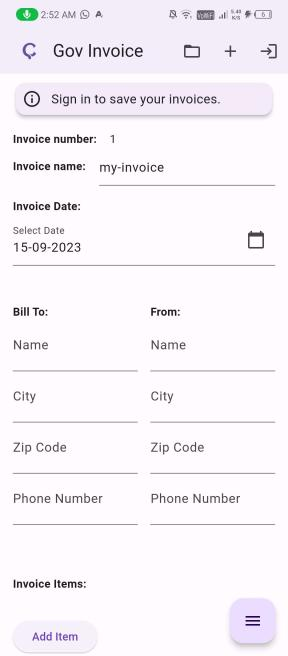
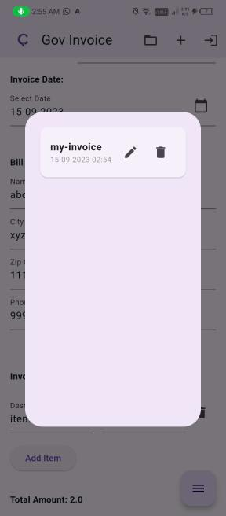

# Gov Invoice 
A cross platform application to generate, save and share Invices.

## Features
* Magic Link Authentication
* Invoice Storage
    * Invoices are stored locally when user is not signed in.
    * Invoices are synced to database when user is signed in.
* Print Invoice to Pdf.
* Share Invoice pdf with email.

    
# Important Links
**Presentation**: [https://drive.google.com/file/d/1v5bWKz1QZjFxYlutLTZLXC2gsbie-yN-/view?usp=drivesdk](https://drive.google.com/file/d/1v5bWKz1QZjFxYlutLTZLXC2gsbie-yN-/view?usp=drivesdk)

**Demo Video**: [https://drive.google.com/file/d/1vSN55ZeKz7P3mZrcWEshzp5Uq1azRm2v/view](https://drive.google.com/file/d/1vSN55ZeKz7P3mZrcWEshzp5Uq1azRm2v/view)

# Team Details
**Team Name:** Codex
## Members
| Name              | College | Year    |
|-------------------|---------|---------|
| Simran            | ECAM    | 2nd Year|
| Devanshu Raj      | CIOT    | 2nd Year|
| Dhananjay Singh   | MAC     | 2nd Year|
| Shubham Tiwari    | CIOT    | 2nd Year|
| Vishal Kumar      | CIOT    | 2nd Year|
| Yashasvi Choudhary| CIOT    | 2nd Year|
